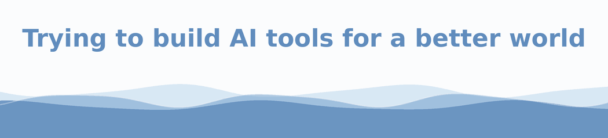

  

  <strong>Engineering self-improving, self-auditing agentic systems and optimization loops:</strong> 
  Sense → Think → Act → Learn. Resilient by architecture, honest by calibration — every metric anchored in reality/ground-truth, every loop Goodhart-robust.

My main work is **DELFIN**, an open-source, AI-orchestrated computational chemistry platform for automated molecular property prediction and inverse molecular design. It connects structure generation, quantum chemistry workflows, machine-learning potentials, interactive dashboards, automated reports, and AI agents into one practical research platform.

## About me

- I build AI-assisted tools for chemistry, simulation, and scientific automation.
- I care about making complex scientific workflows easier to use, reproduce, and extend.
- I work at the intersection of computational chemistry, software engineering, and AI agents.
- I like tools that turn expert-only workflows into practical research infrastructure.

## What I work on

- AI-assisted tools for scientific discovery
- Computational chemistry and molecular property prediction
- Automated DFT workflows for redox potentials, spin states, spectra, and excited-state dynamics
- Human-friendly dashboards for complex scientific software
- Reproducible research infrastructure

## Featured project

  

DELFIN is an AI-orchestrated computational chemistry platform designed to turn molecular input into reproducible quantum-chemical predictions.

It supports workflows such as:

- SMILES-to-property prediction
- automated structure generation for organic molecules and metal complexes
- redox potential and spin-state prediction
- spectroscopy and excited-state calculations
- inverse molecular design with evolutionary optimization
- AI-agent support for workflow control, analysis, and code development

## Direction

I want to build tools that help researchers move faster, test ideas earlier, and make complex scientific methods usable beyond small expert circles.

## Core stack

| Area | Tools and focus |
| --- | --- |
| Scientific AI | Python, AI agents, workflow orchestration, automated reasoning over simulation results |
| Computational chemistry | DFT, RDKit, ORCA, xTB, CREST, molecular property prediction, inverse molecular design |
| Frontend & UX | Jupyter, Voila, ipywidgets, py3Dmol, browser-based scientific dashboards |
| Backend & automation | Python CLIs, job orchestration, report generation, reproducible pipeline design |
| DevOps & tools | Linux, Git, GitHub, GitHub Actions, packaging, reproducible research infrastructure |

## Contribution graph

  <picture>
    <source media="(prefers-color-scheme: dark)" srcset="https://raw.githubusercontent.com/hmaximilian/hmaximilian/output/github-snake-dark.svg">
    <source media="(prefers-color-scheme: light)" srcset="https://raw.githubusercontent.com/hmaximilian/hmaximilian/output/github-snake.svg">
    
  </picture>

## Connect & collaborate

I'm interested in collaborations around AI-assisted chemistry, molecular design, automated simulations, and scientific software that helps researchers move from ideas to reproducible results faster.

## What's next

More scientific AI tools are on the way. Stay tuned.

  
   
  

  

